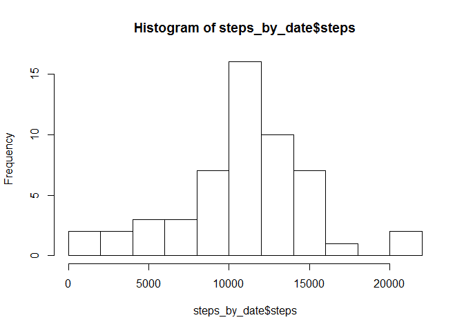
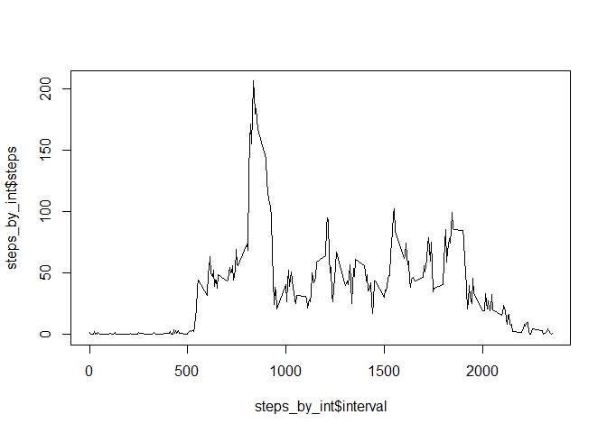
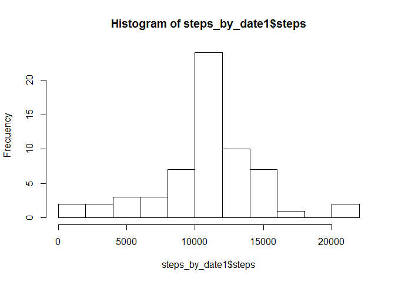
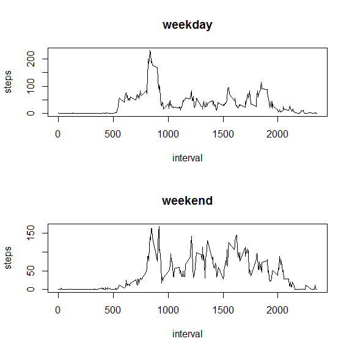

# Reproducible Research: Peer Assessment 1


## Loading and preprocessing the data
1. Load the data (i.e. `read.csv()`)

2. Process/transform the data (if necessary) into a format suitable for your analysis


```r
df <- read.csv("activity.csv")
df$date <- as.Date(df$date)
```


## What is mean total number of steps taken per day?

For this part of the assignment, you can ignore the missing values in
the dataset.

1. Make a histogram of the total number of steps taken each day


```r
library(dplyr);
by_date <- group_by(df, date)
steps_by_date <- summarize(by_date, sum(steps))
names(steps_by_date)<- c("date","steps")
hist(steps_by_date$steps, breaks=15)
```

 


2. Calculate and report the **mean** and **median** total number of steps taken per day


```r
mean(steps_by_date$steps, na.rm=TRUE)
```

```
## [1] 10766.19
```

```r
median(steps_by_date$steps, na.rm=TRUE)
```

```
## [1] 10765
```


## What is the average daily activity pattern?

1. Make a time series plot (i.e. `type = "l"`) of the 5-minute interval (x-axis) and the average number of steps taken, averaged across all days (y-axis)


```r
by_int<- group_by(df, interval)
steps_by_int <- summarize(by_int, mean(steps,na.rm=TRUE))
names(steps_by_int)<- c("interval","steps")
plot(steps_by_int$interval, steps_by_int$steps, type="l")
```

 

2. Which 5-minute interval, on average across all the days in the dataset, contains the maximum number of steps?


```r
max_pos <- which.max(steps_by_int$steps)
steps_by_int$interval[max_pos]
```

```
## [1] 835
```

## Imputing missing values
Note that there are a number of days/intervals where there are missing
values (coded as `NA`). The presence of missing days may introduce
bias into some calculations or summaries of the data.

1. Calculate and report the total number of missing values in the dataset (i.e. the total number of rows with `NA`s)


```r
na_pos <- is.na(df$steps)
sum(na_pos)
```

```
## [1] 2304
```

2. We fill in the missing value of each 5-minutes interval by the mean of that 5-minute interval, averaged across all days .

3. Create a new dataset that is equal to the original dataset but with the missing data filled in.


```r
for( i in 1:length(na_pos))
  {
  if(is.na(df$steps[i]))
  df$steps[i] <- steps_by_int$steps[steps_by_int$interval==df$interval[i]]
  }
df1 <- df
```


4. Make a histogram of the total number of steps taken each day and Calculate and report the **mean** and **median** total number of steps taken per day.  

```r
by_date1 <- group_by(df1, date)
steps_by_date1 <- summarize(by_date1, sum(steps))
names(steps_by_date1)<- c("date","steps")
hist(steps_by_date1$steps, breaks=15)
```

 

```r
mean(steps_by_date1$steps)
```

```
## [1] 10766.19
```

```r
median(steps_by_date1$steps)
```

```
## [1] 10766.19
```
The mean doesn't change when compared with the first part, while the median changes to the similar value as the mean.

## Are there differences in activity patterns between weekdays and weekends?

1. Create a new factor variable in the dataset with two levels -- "weekday" and "weekend" indicating whether a given date is a weekday or weekend day.


```r
library(chron)
df_new <- mutate(df1, day_type=factor(is.weekend(date)))
library(plyr)
df_new$day_type <- revalue(df_new$day_type, c("FALSE"="weekday","TRUE"="weekend"))
```


2. Make a panel plot containing a time series plot (i.e. `type = "l"`) of the 5-minute interval (x-axis) and the average number of steps taken, averaged across all weekday days or weekend days (y-axis). 

```r
df_wday <- subset(df_new, df_new$day_type=="weekday")
by_int_wday<- group_by(df_wday, interval)
steps_by_int_wday <- dplyr::summarize(by_int_wday, mean(steps))
names(steps_by_int_wday)<- c("interval","steps")


df_wkend <- subset(df_new, df_new$day_type=="weekend")
by_int_wkend <- group_by(df_wkend, interval)
steps_by_int_wkend <- dplyr::summarize(by_int_wkend, mean(steps))
names(steps_by_int_wkend)<- c("interval","steps")

par(mfrow=c(2,1))
plot(steps_by_int_wday$interval, steps_by_int_wday$steps, type="l", main="weekday", xlab="interval", ylab="steps")
plot(steps_by_int_wkend$interval, steps_by_int_wkend$steps, type="l", main="weekend", xlab="interval", ylab="steps")
```

 
